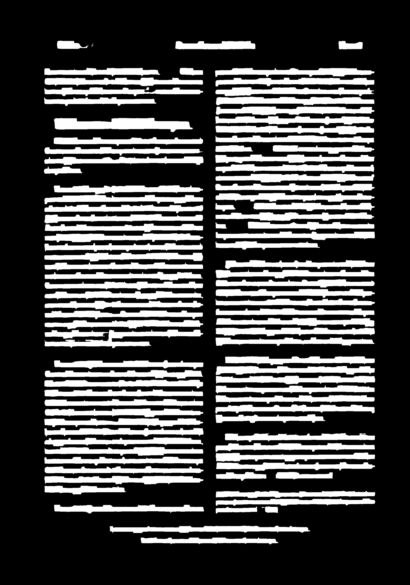

Contrast Example
================

Source of [image](../../assets/images/OCR-D-IMG_DerGemeindebote-p08.png): [GBN Dataset](https://web.inf.ufpr.br/vri/databases/gbn/)

[PAGE-XML file](../input.xml) generated through: [ocrd-gbn](https://github.com/GBN-DBP/ocrd-gbn) + [ocrd-export-larex](https://github.com/bertsky/workflow-configuration/blob/master/ocrd-export-larex) 

Pure CLI
--------

```bash
$ page-xml-draw \
  -i ../input.xml \
  -o output.png \
  --base-dir ../../assets/images
  --page \
    --fill-color black \
    --fill-opacity 1.0 \
    --text-region
      --text-line \
        --fill-color white \
        --fill-opacity 1.0
```

CLI + JSON
----------

```bash
$ page-xml-draw \
  -i ../input.xml \
  -o output.png \
  --base-dir ../../assets/images
  --profile profile.json
```

where the content of [profile.json](profile.json) is

```json
{
    "Page": {
        "FillColor": "black",
        "FillOpacity": 1.0,
        "TextRegion": {
            "TextLine": {
                "FillColor": "white",
                "FillOpacity": 1.0
            }
        }
    }
}
```

Output
------

| [](Original) | [](Binary) |
|:---:|:---:|